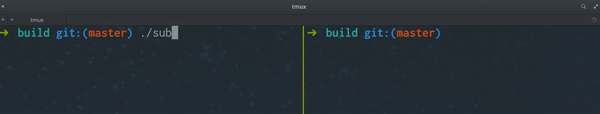

# Vortex OpenSplice DDS playground
> This repository is a testing play ground for people who want to mess around with the [OpenSplice DDS](https://github.com/ADLINK-IST/opensplice). I hold no liability to problems inflicted by using this repository it's purely for education and research.

## Quick words
This repository has only been tested on Linux with the Elementary OS distro and version LOKI. Therefor I can not guarantee it to work on any other system be it linux or mac or windows or even a different distro. 

Once again this repository is purely for research and education and also a bit of fun.

We of course make heavy use of the OpenSplice library so that also includes that the license they are using needs to referenced here

https://github.com/ADLINK-IST/opensplice/blob/master/LICENSE

## Requirements
### TL;DR"
1. `Vortex OpenSplice HDE Release 6.9.190227OSS`
2. `Cmake >= 3.11`
3. `compiler that allows c++17 (tested on g++ 7.4)`


First up you will need to have a release of OpenSplice installed and their requirements.
This repository uses this version of OpenSplice.

`Vortex OpenSplice HDE Release 6.9.190227OSS`

Which means it will only be tested using this version and won't hold any guarantees for other versions.

After installing the release you need to unzip or untar it and place it somewhere you know where to find it.

After unzipping there is a tiny modification you need to do in the custom_lib folder to allow c++11 functions.
> source https://stackoverflow.com/a/29347771

You need to go to `custom_lib/Makefile.Build_DCPS_ISO_Cpp_Lib` and open it in a text editor. Add -std=c++0x to the CPPFLAGS line fixed the problem.
(Don't forget to recompile with make -f Makefile.Build_DCPS_ISO_Cpp_Lib)

after the recompile you are ready to build the example.

## Building
To be able to build the project you will need to add some ENV variables.

The most important one is OSPL_HOME this variable should contain the path of your OpenSplice release folder.

For example
> `export OSPL_HOME=/home/me/tools/OpenSplice/HDE/X86_64.linux/`

After this is set you need to source the release.com file that's in the `OSPL_HOME` folder with `source $OSPL_HOME/release.com`.

To make sure you have the correct settings you can run

 `export | grep OSPL`

 Which should return something like

```
OSPL_HOME=/home/me/tools/OpenSplice/HDE/x86_64.linux
OSPL_TMPL_PATH=/home/me/tools/OpenSplice/HDE/x86_64.linux/etc/idlpp
OSPL_URI=file:///home/me/tools/OpenSplice/HDE/x86_64.linux/etc/config/ospl.xml
```
If that is all fine and dandy you can start the build process with.

`mkdir build && cmake ..` This will prepare your makeFile and other goodies.
To create the actual executable you run `make` and it will create 2 executables named `publisher` and `subscriber`.

Run `./subscriber` in one terminal and `./publisher` in another.
If you type something in the publisher terminal it should show you the data in the subscriber channel.



### Et voila you have a running helloWorld example of OpenSplice DDS